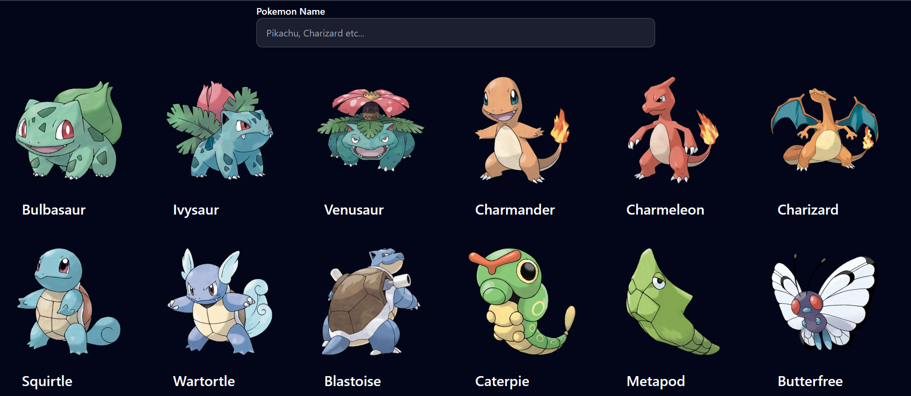
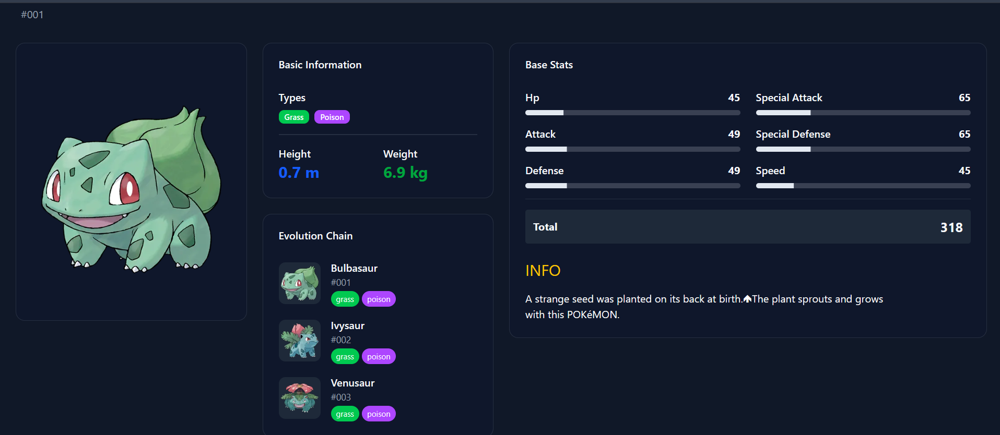

# PokéIndex⚡

Welcome to **PokéIndex**, your ultimate digital companion for exploring, discovering, and learning about every Pokémon in existence. From classic favorites to legendary creatures, this application provides detailed information about abilities, stats, and evolutions in a sleek, modern interface.

---

[Live Link](https://poke-index-chi.vercel.app/)
---

##  Core Features

- **Discover & Search**: Browse a vast collection of Pokémon or use the intuitive search bar to find your favorite instantly.
- **Comprehensive Data**: Access detailed information for each Pokémon, including types, height, weight, and official Pokédex entries.
- **In-Depth Stats**: Analyze base stats (HP, Attack, Defense, Special Attack, Special Defense, Speed) in a clean format.
- **Evolution Chain**: Visualize the complete evolution path from base form to final stage.
- **Modern & Responsive UI**: A dark-themed, mobile-friendly design that adapts beautifully across devices.

---

##  Screenshots

### Landing Page


### Pokémon Grid & Search


### Detailed View


---

##  Tech Stack

- **Framework**: [Next.js](https://nextjs.org/)
- **UI**: [shadcn/ui](https://ui.shadcn.com/)
- **Styling**: [Tailwind CSS](https://tailwindcss.com/)
- **Data Source**: [PokéAPI v2](https://pokeapi.co/)
- **Deployment**: [Vercel](https://vercel.com/)

---

## Getting Started

Follow these steps to run PokéIndex locally:

### 1. Clone the repository
```bash
git clone https://github.com/Vijaykr35/pokeIndex.git
